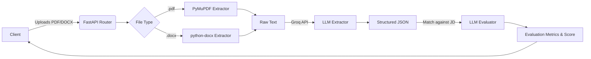

<div align="center">
  
# 📄 AI Resume Parsing & Evaluation Engine

[](https://www.python.org/downloads/)
[](https://fastapi.tiangolo.com)
[](https://groq.com/)
[](https://opensource.org/licenses/MIT)

A production-grade, asynchronous extraction pipeline that parses PDF and Word resumes into deterministic JSON schemas, powered by **FastAPI** and **Groq's high-speed Large Language Models**.

[Features](#-key-features) • [Architecture](#-system-architecture) • [Quick Start](#-quick-start) • [API Reference](#-api-reference) • [Project Structure](#-project-structure)

</div>

---

## ✨ Key Features

- **Omni-Format Parsing**: Native, fault-tolerant extraction from `.pdf` (via PyMuPDF) and `.docx` (via python-docx) formats.
- **Deterministic JSON Generation**: Transforms unstructured human text into heavily validated, strongly-typed JSON schemas using state-of-the-art LLM extraction.
- **Intelligent JD Matching**: Evaluates extracted candidate profiles against target Job Descriptions, providing a standardized match score (0-100) and actionable qualitative feedback.
- **Asynchronous & Non-Blocking**: Built from the ground up on FastAPI, ensuring concurrent file processing and non-blocking I/O during LLM network calls.
- **Production-Ready**: Includes centralized logging, robust error handling, and scalable dependency management via `uv`.

---

## 🏗 System Architecture



---

## 🚀 Quick Start

### 1. Prerequisites
- **Python 3.14** or higher
- **[uv](https://docs.astral.sh/uv/)** (Ultra-fast Python package installer and resolver)

### 2. Environment Configuration
Clone the repository and set up your environment variables. The system requires a Groq API key to handle the LLM inference.

```bash
cp .env.example .env
```
*(If `.env.example` does not exist, simply create `.env`)*

**`.env` Configuration:**
```ini
# Required: Your Groq API key for LLM inference
GROQ_API_KEY="gsk_your_groq_api_key_here"
```

### 3. Installation & Execution
Utilize `uv` to synchronize dependencies and launch the ASGI server in a single workflow:

```bash
# Sync dependencies from uv.lock
uv sync

# Start the Uvicorn server with hot-reloading
uv run uvicorn app.main:app --host 0.0.0.0 --port 8000 --reload
```

The API is now accepting connections at `http://localhost:8000`.

---

## 📖 API Reference

Interactive API documentation (Swagger UI) is automatically generated and available at **[`http://localhost:8000/docs`](http://localhost:8000/docs)**.

### 1. Extract Candidate Profile
Converts a raw resume document into structured data.

- **Endpoint**: `POST /extract`
- **Content-Type**: `multipart/form-data`
- **Parameters**: 
  - `file` (File, Required): The `.pdf` or `.docx` resume.

**cURL Example:**
```bash
curl -X POST "http://localhost:8000/extract" \
  -H "accept: application/json" \
  -H "Content-Type: multipart/form-data" \
  -F "file=@/path/to/candidate_resume.pdf"
```

<details>
<summary><b>View Response Payload</b></summary>

```json
{
  "status": "success",
  "data": {
    "personal_info": {
      "name": "Alex Mercer",
      "email": "alex.mercer@example.com",
      "phone": "+1-555-0198"
    },
    "skills": ["Python", "FastAPI", "Machine Learning", "LLMs", "Docker"],
    "experience": [
      {
        "role": "Senior AI Engineer",
        "company": "TechFusion Corp",
        "duration": "2021 - Present",
        "highlights": [
          "Architected high-throughput data extraction pipelines.",
          "Reduced LLM inference latency by 40%."
        ]
      }
    ],
    "education": [
      {
        "degree": "M.S. Computer Science",
        "institution": "Stanford University"
      }
    ]
  }
}
```
</details>

### 2. Evaluate Against Job Description
Analyzes a candidate's resume against a specific role to determine fitness and generate a match score.

- **Endpoint**: `POST /evaluate`
- **Content-Type**: `multipart/form-data`
- **Parameters**: 
  - `file` (File, Required): The `.pdf` or `.docx` resume.
  - `job_description` (String, Required): The target JD text.

**cURL Example:**
```bash
curl -X POST "http://localhost:8000/evaluate" \
  -H "accept: application/json" \
  -H "Content-Type: multipart/form-data" \
  -F "file=@/path/to/candidate_resume.pdf" \
  -F "job_description=Looking for a backend engineer proficient in Python, FastAPI, and generative AI integrations."
```

<details>
<summary><b>View Response Payload</b></summary>

```json
{
  "status": "success",
  "data": {
    "match_score": 95,
    "summary": "Excellent candidate. Demonstrates deep expertise in required backend technologies and AI integrations.",
    "strengths": [
      "Extensive production experience with FastAPI.",
      "Proven track record integrating LLMs into backend services."
    ],
    "weaknesses": [
      "No explicit mention of Kubernetes, which is a nice-to-have."
    ],
    "recommendation": "Strong Hire"
  }
}
```
</details>

---

## 📁 Project Structure

```text
resume-parser/
├── app/
│   ├── core/              # Global configs, logging, and LLM client initialization
│   ├── extractors/        # Format-specific document parsers (PDF, DOCX)
│   ├── schemas/           # Pydantic models for strict I/O validation
│   ├── services/          # Core business logic (Extraction & Evaluation orchestration)
│   └── main.py            # FastAPI application factory and router definitions
├── .env                   # Environment variable configuration (git-ignored)
├── pyproject.toml         # Modern Python project metadata
├── uv.lock                # Deterministic dependency lockfile
└── README.md              # Project documentation
```

---

<div align="center">
  <i>Built for high-performance AI document processing.</i>
</div>